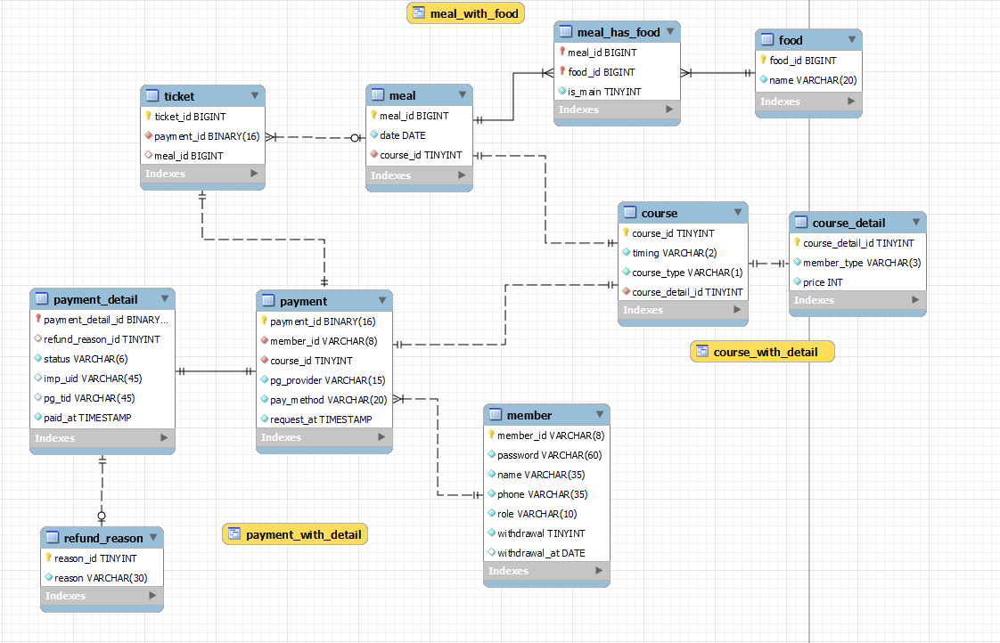

# have-a-meal database
## description
- member
    - withdrawal : 탈퇴 여부로 **[0] - 사용중인 계정, [1] - 탈퇴한 계정**
- meal_has_food
    - is_main : 메인 메뉴 여부로 **[0] - 메인메뉴 아님, [1] - 메인메뉴임**
- payment_detail
    - status : 결제 진행상태로 **ready(브라우저 창 이탈 등의 미결제 상태, paid(결제 완료 상태), failed(잔액 부족 등의결제실패 상태)**  
## ERD
 
